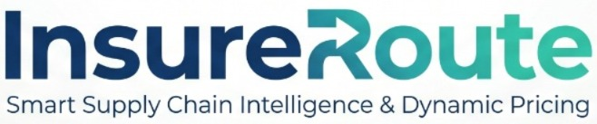

<div align="center">
  
  <h3>Smart Supply Chain Intelligence & Dynamic Pricing</h3>
  <p>Predictive AI-powered logistics intelligence with real-time weather monitoring, algorithmic rerouting, and actuarial risk hedging.</p>

  [](#)
  [](#)
  [](#)
  [](#)
  [](#)
  [](#)
</div>

---

## 🌍 The Global Challenge
Global logistics networks are highly fragile, and current cargo insurance models are incredibly rigid. When sudden disruptions occur (severe weather, port strikes, local accidents), shippers suffer millions in losses, while underwriters struggle to accurately price these dynamic risks.

* **Reactive Routing:** Alternate paths are only found after the delay happens.
* **Static Insurance:** Organisations pay the same premium regardless of whether the transport crosses a clear highway or a flooded monsoon zone.
* **Data Fragmentation:** The data required to fix this exists but is scattered across separate systems with no unified view for risk managers.

## 💡 Our Solution
**InsureRoute** bridges the gap between predictive routing and financial hedging. It is an enterprise-grade platform that operates on three integrated intelligence layers:

1. **Machine Learning Anomaly Detection:** An Isolation Forest model continuously analyses multi-variate transit data (weather severity, historical delays, vehicle telemetry) to predict disruptions before they occur.
2. **Live Weather Intelligence:** Real-time monitoring of geographic checkpoints via OpenWeatherMap, automatically triggering rerouting when dangerous conditions are detected.
3. **Google Gemini AI Advisory:** A context-aware AI risk advisor and live news feed powered by Google Gemini that synthesises all data streams into actionable intelligence: natural-language risk assessments, recommended actions, and defensible logistics insights.

Upon detecting an anomaly, our NetworkX graph algorithm recalculates the safest alternate route, and the actuarial pricing engine immediately provides a dynamic, real-time recalculation of the cargo insurance hedge cost.

---

## 🎯 UN Sustainable Development Goals Alignment
InsureRoute directly tackles major global challenges:

* **SDG 9 — Industry, Innovation and Infrastructure:** Builds resilient logistics infrastructure through predictive AI, enabling supply chains to withstand and adapt to disruptions before they impact delivery timelines.
* **SDG 11 — Sustainable Cities and Communities:** Strengthens urban freight networks by dynamically rerouting cargo away from hazardous zones, reducing accident risk and improving road safety for communities along transit corridors.
* **SDG 13 — Climate Action:** Integrates live weather intelligence to pre-emptively mitigate the impact of extreme weather events on supply chains, helping logistics providers adapt to increasingly volatile climate patterns.

---

## 🚀 Key Features

* **Real-Time Anomaly Detection:** Isolation Forest model predicting delays from multi-variate factors including weather, historical tracking, and time-series patterns.
* **Live Weather Monitoring:** Real-time polling via OpenWeatherMap API with automatic severity classification and disruption triggering.
* **Dynamic Graph Rerouting:** Automatic cargo rerouting using NetworkX and Dijkstra's Algorithm when a path is compromised.
* **Live Route Intelligence:** AI-powered news feed generating real-time, defensible logistics insights by analyzing live weather sensor data via the Gemini API.
* **Google Gemini AI Risk Advisor:** Natural language risk assessments generated by **Gemini 2.5 Flash**, providing actionable recommendations and insurance optimisation strategies.
* **Actuarial Pricing Engine:** Dynamic insurance premium calculation with categorical multipliers (weather, perishable cargo) showing exact financial savings from rerouting.
* **Interactive Disruption Simulator:** Manual injection controls allowing operations managers to stress-test the system and observe ML, routing, and pricing engines react in real time.
* **Enterprise Dashboard:** A premium, responsive operational command centre built in React with real-time KPI tracking, animated network graph visualisation, and a live event stream log.

---

## 📊 Impact Metrics
* **Financial Savings:** Dynamic premium arbitrage saves companies thousands per shipment by avoiding high-risk zones.
* **CO2 Reduction:** Verifiable Scope 3 emissions offset calculations by avoiding gridlock and selecting optimal multimodal paths.
* **Risk Mitigation:** Averting catastrophic shocks by intercepting weather and traffic anomalies before cargo enters the danger zone.

---

## ☁️ Google Technology Integration

InsureRoute is built to scale on Google Cloud and leverages cutting-edge AI:

| Component | Google Service | Purpose |
|---|---|---|
| **AI Risk Advisor** | **Gemini 2.5 Flash** | Contextual risk assessment and natural-language recommendation generation. |
| **Prompt Engineering** | **Gemini API** | System-instruction-based prompt with structured output parsing. |
| **Backend Integration** | **Cloud Run** | Serverless, autoscaling deployment of our FastAPI backend for reliable real-time inference. |
| **Frontend Hosting** | **Firebase / Cloud Run** | Edge-optimised, globally available dashboard deployment. |

The Gemini AI advisor receives the full shipment context (anomaly scores, weather data, insurance pricing, route topology) and produces structured output containing a risk summary, prioritised action items, and insurance optimisation tips — transforming complex multi-source data into clear, actionable intelligence.

---

## 📈 Scalability & 🔮 Future Scope

InsureRoute is designed as a foundational platform capable of massive global expansion:

* **Global Expansion:** The Dijkstra graph routing and OpenWeather integration can be instantly scaled from regional corridors to international shipping lanes.
* **Agentic AI & LLMs:** Processing unstructured text from breaking news and social media feeds into structured risk modifiers using Gemini's multi-modal capabilities.
* **Live IoT Edge Telemetry:** Direct integration with cellular OBD2 truck sensors and Thermo King reefer units via high-throughput message queues.
* **Graph Neural Networks:** Upgrading to GNNs for predicting cascading, multi-node supply chain failures beyond localised edge disruptions.
* **Full Cloud-Native Transition:** Migrating to Cloud SQL for persistent analytics, Pub/Sub for event streaming, and Vertex AI for enterprise model serving.

---

## 💻 Tech Stack

| Layer | Technology |
|---|---|
| **Frontend** | React 18, Vite, Tailwind CSS, Recharts, Framer Motion |
| **Backend** | Python 3.10+, FastAPI, Pydantic |
| **Machine Learning** | Scikit-Learn (Isolation Forest, RandomForest) |
| **Graph Routing** | NetworkX, Dijkstra's Algorithm |
| **AI Advisory** | Google Gemini 2.5 Flash |
| **Weather / Location** | OpenWeatherMap API, Leaflet |
| **Deployment** | Google Cloud Run, Docker |

---

## 🛠️ Quick Start

### Prerequisites
- Python 3.10+
- Node.js 18+

### 1. Clone & Configure
```bash
git clone https://github.com/SanTiwari07/InsureRoute.git
cd InsureRoute
cp .env.example .env
```
Add your keys to `.env`:
```
OPENWEATHER_API_KEY=your_key
GEMINI_API_KEY=your_key
NEWSDATA_API_KEY=your_key
```

### 2. Backend
```bash
cd backend
python -m venv venv
venv\Scripts\activate      # Windows
# source venv/bin/activate # macOS/Linux
pip install -r ../requirements.txt
uvicorn main:app --reload --port 8000
```

### 3. Frontend
Open a new terminal:
```bash
cd frontend
npm install
npm run dev
```

---

## 🏗️ Architecture & Deployment
* **System Architecture:** Deep dive into how our microservices interact. Read [system_architecture.md](system_architecture.md).
* **Deployment Guide:** Step-by-step instructions for deploying to Google Cloud. Read [deployment_guide.md](deployment_guide.md).

---

## 👥 Team
Developed by **HoloSquad** for the Google Solution Challenge 2026.

## 📄 License
This project is licensed under the MIT License. See [LICENSE](LICENSE) for details.
